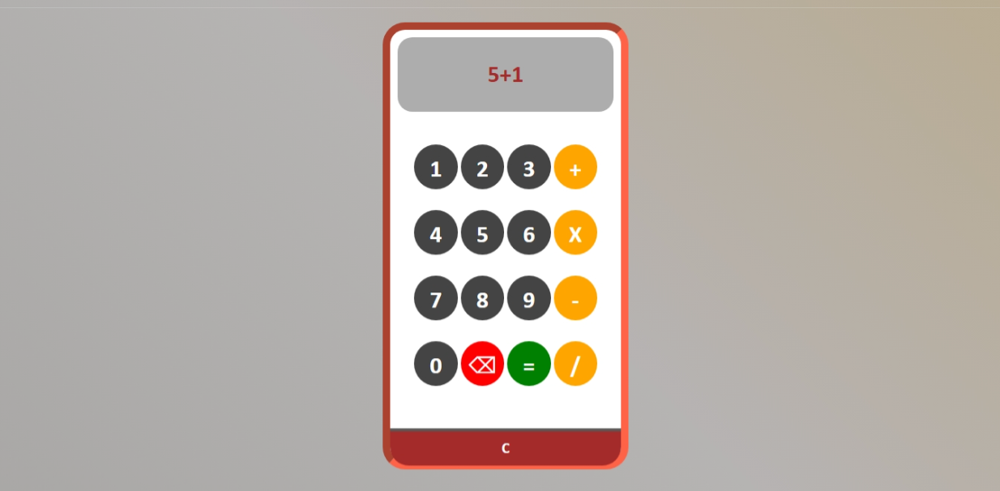

# 🧮 Calculator Web App

A simple and responsive calculator that performs basic arithmetic operations. Built using **HTML**, **CSS**, and **JavaScript**, with smooth animations and a clean UI.

---

## 🔗 Live Demo

👉 [Click here to try it now](https://msdhinesh45.github.io/Calci/) *(update this link if hosted)*

---

## 🖼️ Output Screenshots

### 🔢 Output 1:

### ➗ Output 2:

### ➕ Output 3:

---

## 🚀 Features

- Click buttons to perform calculations
- Handles `+`, `-`, `×`, `÷`, and decimal operations
- `C` to clear all input and `⌫` to delete one character at a time
- Displays input/output on a stylish screen area
- Smooth UI animations with border and hover effects
- Fully responsive layout for all screen sizes

---

## 🛠️ Tech Stack

- **HTML5** – Structure and layout  
- **CSS3** – Styling, animations, gradients  
- **JavaScript** – Logic, DOM manipulation

---

## 📦 How to Use Locally

1. Clone or download this repository.
2. Open the project folder in your favorite code editor.
3. Ensure the files (`index.html`, `styles.css`, `script.js`) are in the same directory.
4. Open `index.html` in your browser.
5. Use the calculator just like a regular one!

---

## 🙋 Author

**Dhinesh Kumar**  
🎓 B.Sc IT | M.Sc CS (Pursuing)  
🌐 GitHub: [@msdhinesh45](https://github.com/msdhinesh45)

---

## 📄 License

This project is open-source and free to use for learning or personal use.  
✅ No license required.

---

✨ *Made with logic, design, and a little bit of JavaScript magic!*
